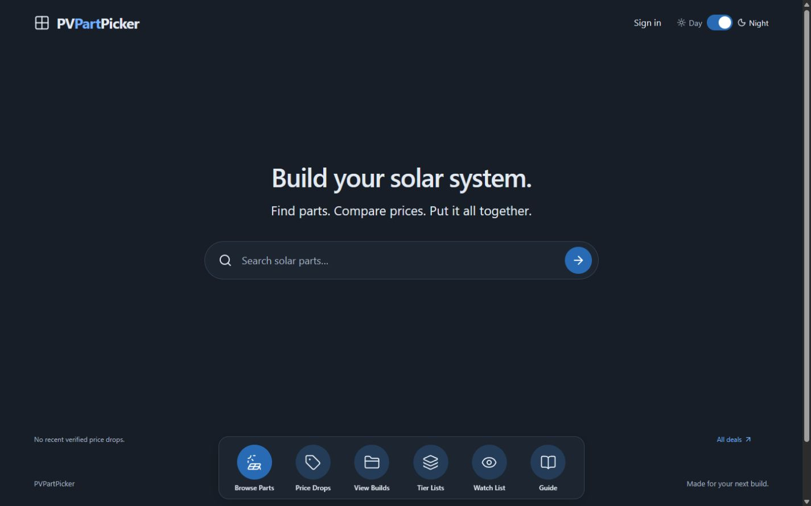
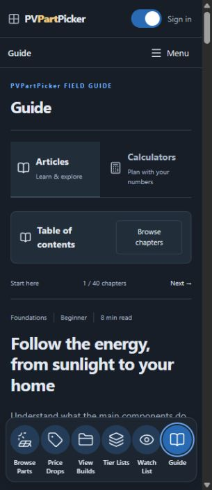
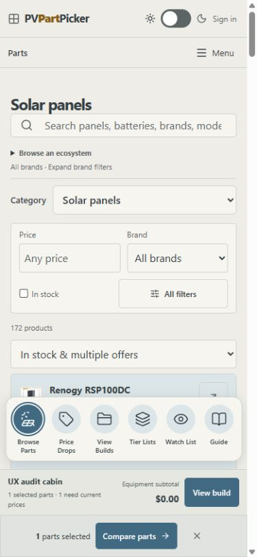
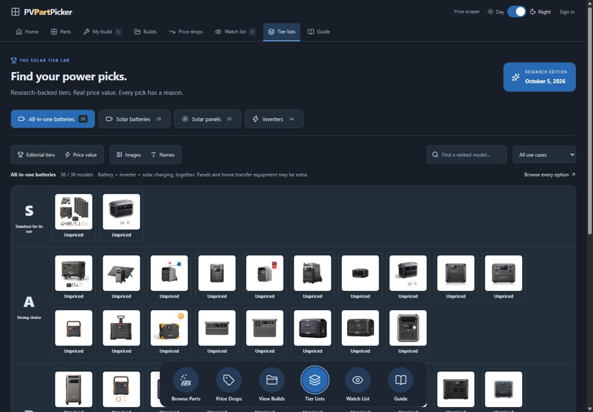
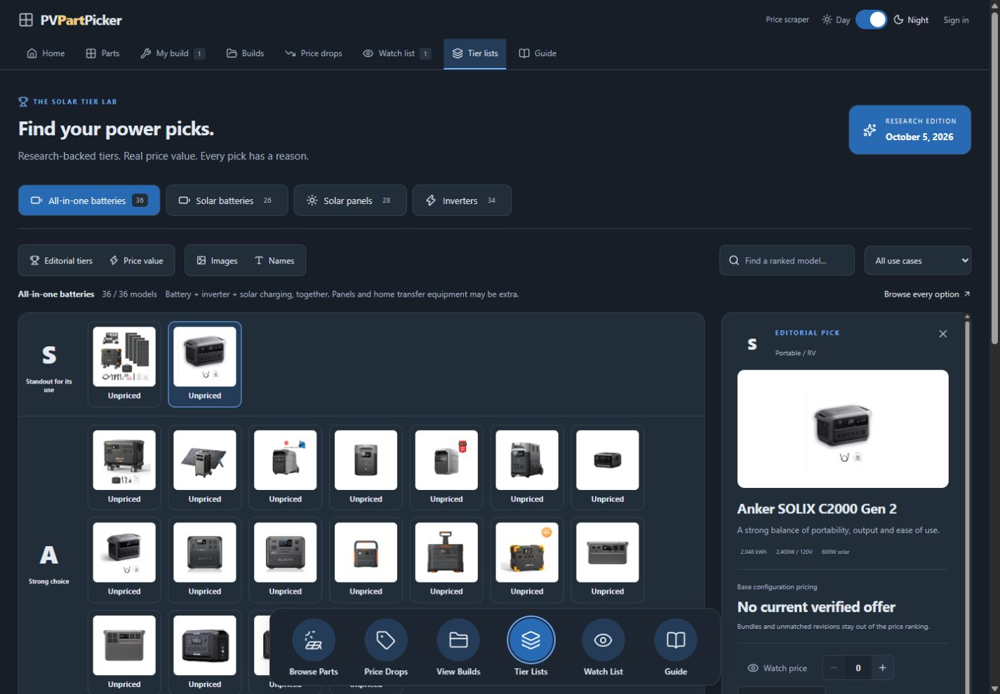
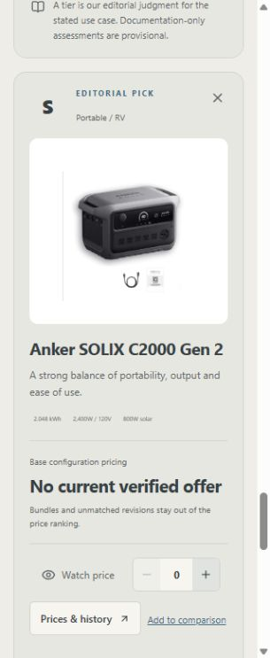

# Floating shortcuts beta

Requested October 6, 2026. Experiment branch: `codex/beta-floating-shortcuts`. Production stays on main. Do not promote this design until the owner approves it.

Beta project: `appgprj_6ac4ad41116c8191ba232ae226bde035`
Beta URL: https://pvpartpicker-beta.fwad101.chatgpt.site
The beta is owner-private and uses its own Sites source checkout, hosting identity and D1 database. It starts with the checked-in, attributed catalog snapshot; production account builds, reviews, overrides and price observations are not copied. Do not copy production secrets or change its audience.

Canonical feature source lives in site/ on this branch. The production hosting manifest in this GitHub checkout retains its existing identity. Beta publication uses a sanitized checkout at output/beta-floating-site with the beta project ID persisted in its own .openai/hosting.json. Reuse the beta ID for updates, never register another beta.

## Interaction contract

Use the six approved circular icons: Browse Parts, Price Drops, View Builds, Tier Lists, Watch List, Guide. One shared floating dock replaces the home icon row and appears across routes. Highlight the current section; Home emphasizes Browse Parts without falsely marking it as the current page. Keep the regular header and Menu as alternate navigation when the dock hides.

Fade/slide the dock out above 96px scroll and reveal it at or below 32px. Scrolling upward in the middle of an article does not reveal it. Hidden links are inert and outside the accessibility tree. Keyboard focus keeps the dock visible; mouse focus must not prevent scroll hiding. Honor reduced motion and print styles.

Phone circles are 44px, with visible labels. Measure bottom trays, comparison controls and notices; observe late-mounted bars as catalog data finishes loading. Keep at least 12px between the dock and those controls. Reserve trailing space to keep final content reachable. Use existing tokens and SiteLink navigation/prefetch.

## Validation

222 existing tests, TypeScript and Worker build passed. Built Worker browser checks: 1440px desktop night, 320px Guide night, 390px Parts day, scroll hide at 400/500px, remaining hidden at 200px on upward scroll, reveal at page top, mouse navigation then scroll, 44px circles, no phone document overflow, late catalog tray and stacked comparison bars, reduced-motion near-zero duration. No cloud writes or production modifications made. Local comparison and theme restored after QA. Physical phone and authenticated beta workflows remain untested.

## Screenshots

## Tier inspector update - October 6, 2026

Opening `/tiers` starts with no selected model and a full-width board. Selecting a model expands a 360px details column over 300ms (320px at narrower desktop widths). Close returns the board to full width and keyboard focus to the selected model. Changing category or filtering the selected model out clears the panel instead of automatically choosing another result. Explicit `?model=` links still open their requested model.

On phones the panel expands below the board, then scrolls into view and receives focus after the layout settles. Hidden panels are inert and excluded from the accessibility tree. Reduced motion disables the transition and uses immediate scrolling.

Validation: 222 tests, TypeScript and Worker build passed. Built Worker checks covered initial full width, click selection, measured intermediate animation widths, Close and Enter keyboard activation, category reset, explicit model links, 1440px night and 320/390px day/night phone layouts, collapsed zero-height mobile slot, and reduced motion. No product, draft or watch state was changed.

