# Mobile UX review — October 6, 2026

Scope: public PVPartPicker flows, using the built Worker and the in-app browser at 320px and 390px portrait widths. Existing Night Inventory desktop design and circular home layout are retained. The browser reserves 15px for a scrollbar (measured content widths 305px / 375px).

## Findings and changes

1. **Navigation:** sideways navigation hid Guide, Watch list and Tier lists and repeated categories above the catalog. On phones a current-section label and Menu open a two-column dialog with every section, counters, account and scraper links. Desktop retains horizontal navigation; phone category selection remains in Parts. Escape, focus restoration and route changes were checked.
2. **Catalog filters:** all technical filters appeared after thirteen category buttons; the results action was below the screen. Categories now expand on demand, the filter body scrolls independently, and Show products remains in a fixed dialog footer. Condition remains in All filters; the phone quick toolbar focuses on price, brand, stock and the full filter action.
3. **Product rows:** four boxed specifications consumed too much vertical space. Phone rows use compact labeled values with full watch, compare and +/- controls. Product details reduce the large photo to 190px so the model, price and actions appear sooner.
4. **Touch and forms:** several controls were 28–35px high, with small input text. Main phone form controls use 16px text and 44px minimum heights; builder quantities, preference toggles, period controls, close buttons and category filters have larger targets. This addresses common iOS focus zoom, but physical iOS testing was not performed. The visual theme switch retains its compact track.
5. **Calculators:** later tools were hidden beyond a horizontal scrollbar. Phones have a labeled calculator selector exposing all nine tools; desktop retains the list. Switching away and back retains an edited voltage input.
6. **Tier images:** names depended on mouse hover. Photo names now appear beneath images on phones while image/name display options remain.
7. **Bottom controls:** catalog tray, comparison dock and toast need independent space. Phone bars reserve safe-area padding and stack without overlapping. At 320px the comparison bar was 64px high and the build tray sat immediately above it; page bottom padding leaves final content reachable.
8. **Watch list:** the sign-in text wrapped its arrow onto a separate line. Phone storage notice links stay grouped and can wrap as a unit.

## Flow review

| Step | Page / task | Result and remaining limits |
| --- | --- | --- |
| 1 | Home / shortcuts | Working; approved six circular shortcuts retained. No current verified deals, honest empty state retained. |
| 2 | Parts / search, specs, category | Working; compact specs, full-width sort, accessible category dropdown; no page overflow. |
| 3 | All filters / Bifacial | Working; 172 to 62 local catalog results, sticky results action, focus restored to All filters. |
| 4 | System Builder / choose and add | Working; + returns to build, quantity 16 to 17, settings retained. No build saved to user or community accounts. |
| 5 | System connections / history | Working; vertical nodes, full-width controls; real 8S2P example retains 198.91V cold Voc, 159.76V Vmp, 10.02A Imp. Detailed tables scroll inside their region. |
| 6 | Builds / saved / community | Working landing and device/empty collection states; no cloud build writes made. |
| 7 | Product / specs / price history | Working; photo shortened and tabs/actions remain available. Wide numerical tables intentionally scroll inside a container. |
| 8 | Tier lists / images and names | Working; labels visible without hovering; 320px lanes wrap. Rankings/data unchanged. |
| 9 | Price drops / period and filters | Working controls and empty state; no real drops available to exercise a populated drop collection. |
| 10 | Watch list / populated state | Working with one real local test product; filters and actions retained. |
| 11 | Compare / two products | Working; wide comparison table stays horizontally scrollable within its region. |
| 12 | Guide / contents and reading | Working collapsed chapter navigation, diagrams and readable article layout. |
| 13 | Calculators / tool switching | Working dropdown, inputs and graphs. Voltage edit retained across a tool change. |
| 14 | Account / Price scraper | Public access screens working. Owner-only controls and authenticated cloud workflows not browser-tested. |

## Screenshots

Captured during this review; rejected loading/crossfade captures were replaced. Before screenshots are from production version 50; after screenshots show the local validated changes. Any test draft/watch/compare data is restored after QA.

### Catalog and filters

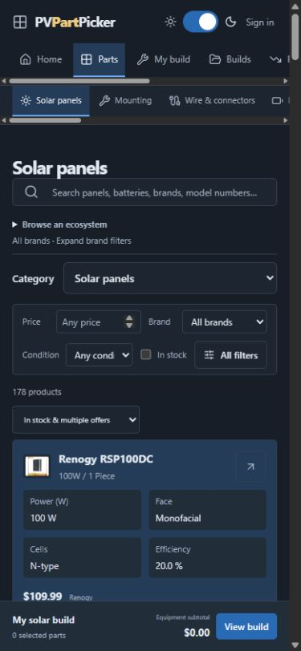
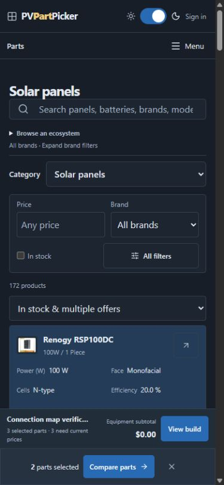
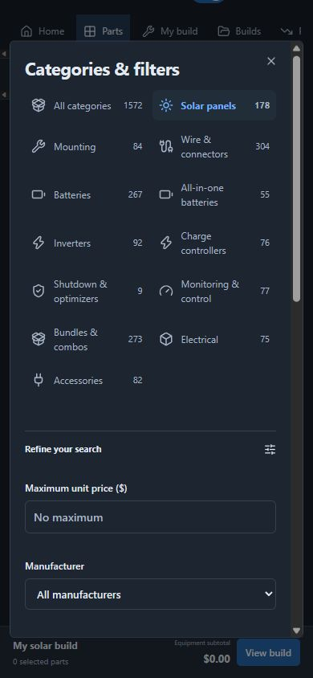
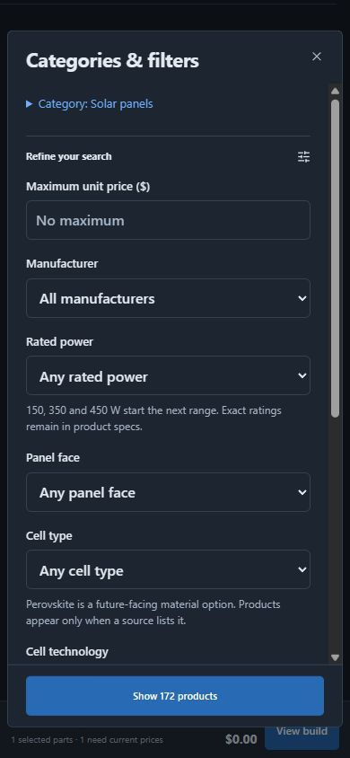

### Navigation and reading

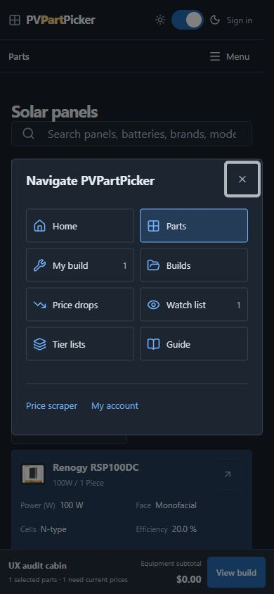
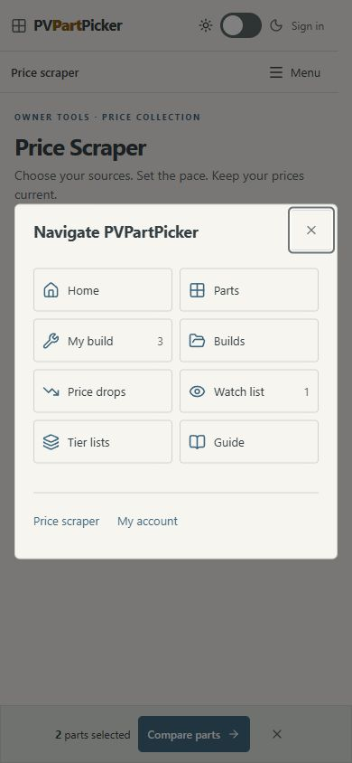
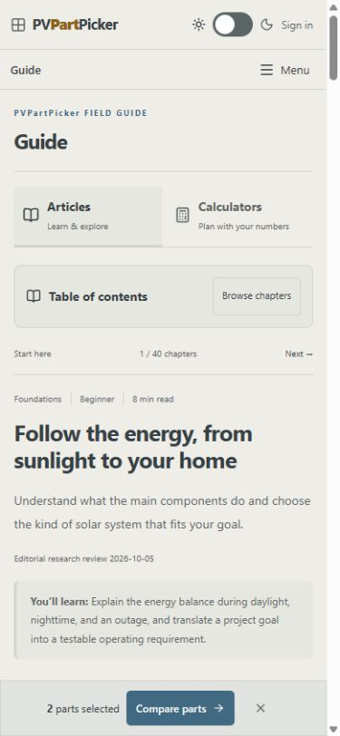

### Builder and calculators

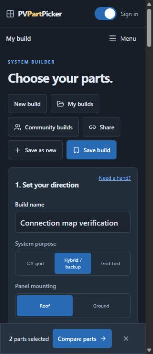
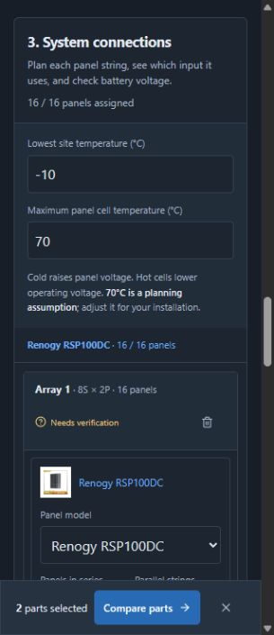
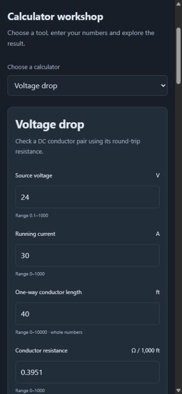

### Product details and watch list

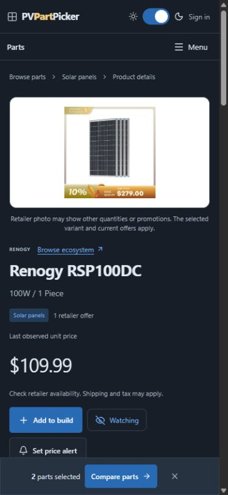
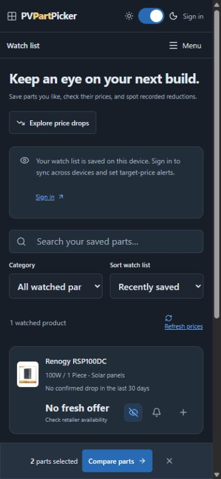

### Tier labels

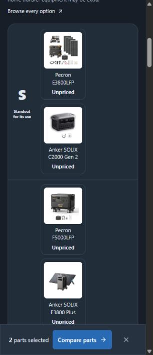

## Validation boundary

222 existing tests passed, TypeScript and production Worker build passed. Browser checks cover 14 core page types at phone widths and both themes, navigation dialog focus/Escape, filter application, builder return/quantity, calculator drafts, populated watch/compare states and bar stacking. No page-level horizontal overflow was observed; charts and specification/compare tables retain deliberate local scrolling. Desktop and landscape regression checks are recorded in design-qa.md. Screenshot review and keyboard checks are not a full accessibility certification, physical touch-device check or authenticated account/owner-console audit.
