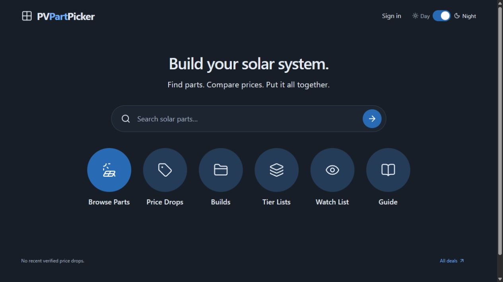
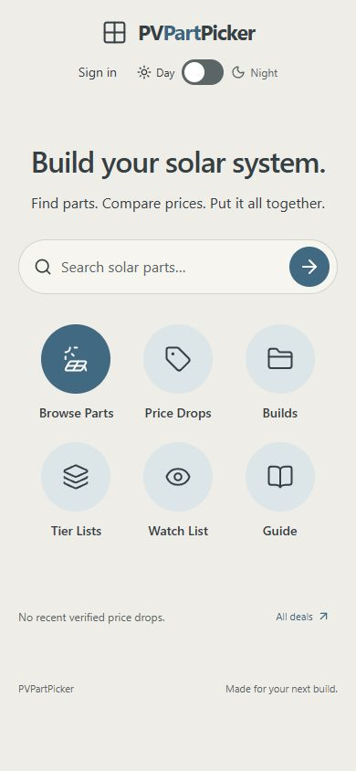

# Beta promotion without floating navigation — October 6, 2026

The owner approved promoting all beta features except the floating bottom section dock. Removed its component, CSS, import, render and reserved trailing space. Restored Home's original six circular links from main. The shared desktop header and phone Menu remain unchanged. Product sidebar/history, always-visible detail prices/specs, click-open tier inspector, build analytics and session-aware WebMCP remain included.

Built Worker checks: six Home shortcuts, no dock/spacer nodes, desktop night and 390px day Home; phone Guide has no horizontal overflow and its Menu opens all sections. Theme and viewport restored. All 249 tests, TypeScript and Worker build pass. Review identified and resolved a watch-state race: immediate native WebMCP watch/unwatch now leaves the persisted device list and current tool state consistent, before any rendered-state dependency. Three regression tests cover opposite changes, failed persistence and overlapping different-product writes. Original device watch data restored after testing.

Production uses its existing Sites identity and database; no beta database or secrets are copied. Main publication must be verified before deleting the isolated private beta.

