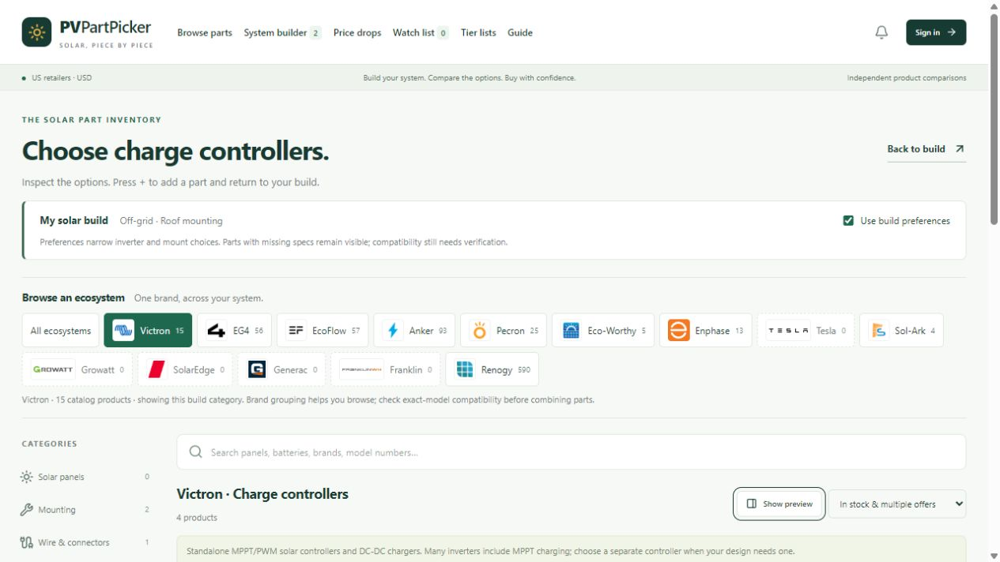
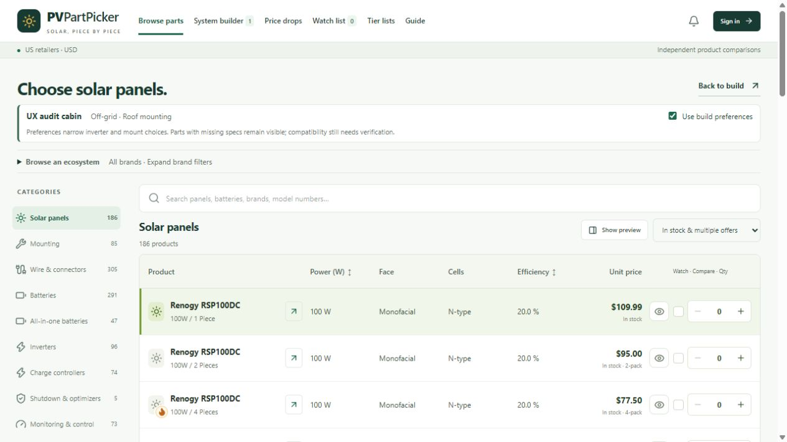
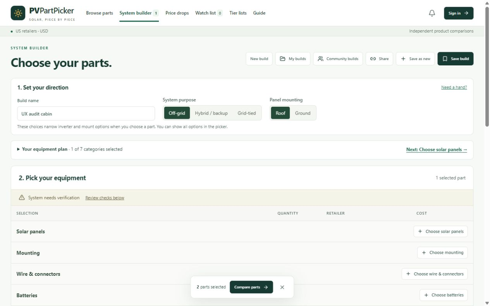
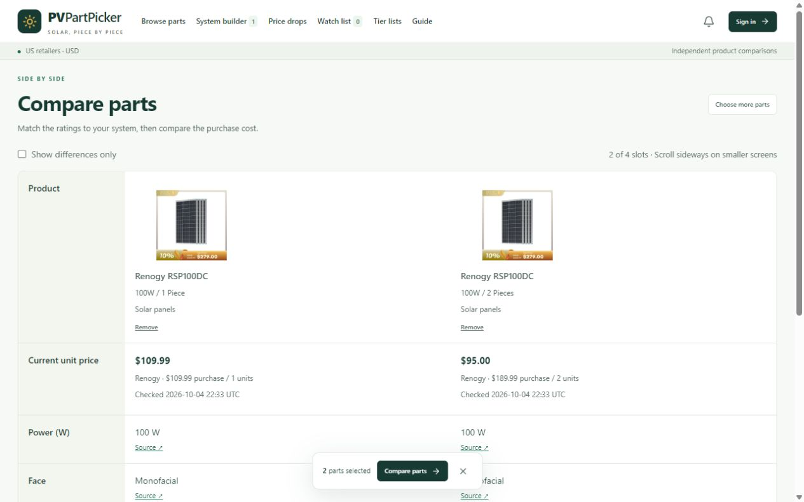
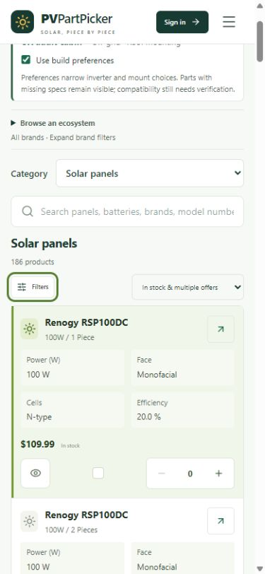
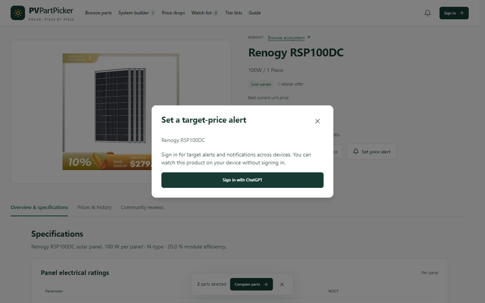

# PVPartPicker whole-site usability audit

Audited 2026-10-05. Public baseline: Site version 32. Implementation: the October 5 usability pass accompanying this report.

**Rating: 6.5/10 before; 8/10 after this pass.** These are an expert assessment, not a measured user-satisfaction score. The compact product inventory, source-linked specifications, named builds, and illustrated Guide give the site a useful foundation. The main weaknesses were finding and returning to parts, mobile controls, unclear state, fragile recovery, and purchase-cost decisions. This pass improves those flows without replacing the familiar equipment tables with another visual concept.

The 9/10 goal still needs broader verified product data, faster cold loads, richer system allocation, and task testing with real beginners and experienced builders. A green test suite alone does not establish that score.

## Scope and evidence

Reviewed live public journeys, existing code, and the changed application in a local production build. Desktop, 768px tablet, and 390px phone views were checked. Screenshots were captured during this audit and visually inspected. No production account data, reviews, source settings, or builds were modified for testing. Device-only build actions were tested on a separate localhost origin.

Signed-in account, email delivery, owner scraper operation, and moderation were inspected in code and covered where noted by automated tests; their authenticated browser operations were not exercised. This is not an accessibility-conformance certification, electrical-design approval, or a complete catalog/specification audit.

## Journey health

| Step | Journey | Before | After / validation |
| --- | --- | --- | --- |
| 1 | Browse parts and ecosystem | Crowded first screen; state hard to resume | Compact heading and collapsed ecosystem; clear selected filters; search/filter URL restoration exercised |
| 2 | Pick a part and return to build | Detail action depended on discovery; retailer silently fixed | Direct details links; picker add returns to build; automatic purchase-cost default verified |
| 3 | Plan and edit a system | Missing next step; fragile quantity/draft handling | Compact equipment progress, next-category link, validated quantities, clear/Undo and saved-device reopen exercised |
| 4 | Product specifications and history | Long heading; parent retailer photo can mislead | Concise name plus variant; explicit photo caveat; source tables retained; offers/history tab checked |
| 5 | Compare products | Basic card comparison lacks useful context | Unit-aware semantic table, sources, package prices, category context and differences-only mode exercised |
| 6 | Watch list | Current-price recency difficult to assess | Checked timestamps added; existing local/account behavior retained; guest state reviewed |
| 7 | Price drops | Recency unclear; empty daily result is possible | Checked timestamps added; real empty results retained; filters and guest page reviewed |
| 8 | Tier lists | Keyboard focus could change selection | Selection changes on activation; image mode retained; evidence/pricing coverage remains uneven |
| 9 | Guide articles | Useful contents and diagrams; very long pages | Shell/navigation readability improved; existing contents, sources and illustrations reviewed; no claim that all chapters were rewritten |
| 10 | Calculators | Dense technical tools need explanation | Existing nine-tool navigation, graphs and explanations reviewed; global focus/contrast improved; numerical validation not re-audited in this pass |
| 11 | Community builds | No public builds to browse | Honest empty state retained; no fabricated community content added |
| 12 | My account / saved builds | Fetch errors could look like an empty library | Loading/error/retry states, mutation guards and deletion protection; device save/open tested, account failure behavior code-reviewed |
| 13 | Price Scraper | Old source details could appear under a new source; polls could overlap | Identity-aware loading/retry, non-overlapping polls and filter recovery; owner-only controls code-reviewed/tested |
| 14 | Administration | Owner gate; dense technical forms | Access gate reviewed; broader owner UX work remains; no moderation or source writes made |
| 15 | Mobile and keyboard | Difficult filters; tiny actions; navigation state unclear | Filter dialog, phone category selector, 44px primary row controls, focus restoration, menu Escape and dialog trap checked |
| 16 | Loading and recovery | Cold phone catalog timed out during audit | Two-minute cache plus bounded recent-data fallback; expired-data warning and preserved timestamps; large cold payload remains |

## Issues fixed

| ID | Issue / impact | Implemented change |
| --- | --- | --- |
| F01 | Welcome/context/brand blocks pushed equipment below the initial desktop view | Reduced heading/context height; ecosystems become a native disclosure that retains company logos |
| F02 | Ecosystems without products looked actionable | Disable empty brand choices and preserve their counts |
| F03 | Search and filters disappeared on reload or when sharing the picker URL | Read/write validated query, brand, price, condition, stock, sort and category-group state; preserve builder context |
| F04 | Applied filters were hard to understand or remove | Removable active-filter pills and explicit empty-result recovery |
| F05 | Phone users could not conveniently reach full sidebar controls | Category select and focus-managed, scrollable Filters dialog with result count |
| F06 | Single row activation previewed a part but specifications were hard to discover | Explicit details arrow with accessible label; existing preview and double-click retained |
| F07 | Adding a part silently pinned a retailer, preventing cheaper package choices at larger quantities | Default builder addition leaves retailer automatic; purchase-cost selection follows quantity; explicit condition selection retains its matching offer |
| F08 | A New-only filter could still add a used offer | Pass the selected condition-specific offer through row, preview and inspector additions; regression test added |
| F09 | Comparison lacked category-specific units and provenance | Reuse relevant specification columns, unit formatting and source links in a semantic table |
| F10 | Comparison made similarities harder to scan | Differences-only toggle, selected variant/category labels, missing-data explanation and sticky row labels |
| F11 | Product headings mixed model names with retailer marketing | Short name plus separate configuration/variant |
| F12 | Shared/promotion-filled retailer images could imply the wrong quantity or price | Caption explains that selected variant and current offers govern; original sourced images retained |
| F13 | Custom alert popup did not provide reliable keyboard/modal behavior | Radix dialog, focus trap, Escape, focus restoration and phone scrolling; clearer guest explanation |
| F14 | Builder provided little direction after choosing system purpose | Compact progress disclosure and next missing category, conditional plan categories, station/bundle guidance |
| F15 | Quantity and string values could accept misleading/invalid entries | Whole-number bounds, normalization and inline errors; quantity committed on blur |
| F16 | Global string calculations could imply a pass without enough selected equipment or assignment context | Insufficient-panel mismatch; unknown state for mixed models/multiple inverters; clearly limited allocation guidance |
| F17 | Clear draft could remove useful work with no immediate recovery | Undo retained until subsequent edits |
| F18 | Malformed saved drafts could be silently overwritten | Validate restoration, show a recovery state, preserve unreadable raw data and guard draft writes |
| F19 | A blank draft name could incorrectly trigger corruption handling | Restore a default name while retaining valid equipment lines |
| F20 | Opening a valid saved build did not leave draft recovery mode reliably | Central replacement helper archives malformed data, writes valid target, clears recovery and supports subsequent edits/reload |
| F21 | Account request failure looked like a successfully empty library | Explicit loading/error/retry; prevent false empty success; pending guards |
| F22 | Deleting an account build could lose the relation to the open draft | Confirm recoverable action, retain draft contents, clear deleted saved identity and prevent duplicate mutations |
| F23 | Scraper source details could race during rapid source changes | Tie details to selected identity; clear old data; loading/error/retry for selected source |
| F24 | Slow scraper polling could overlap, and filtered runs lacked recovery | Non-overlapping poll cycle; explain filtered empty state and allow clearing filters |
| F25 | Merely focusing a tier card changed the displayed selection | Selection only on user activation, preserving keyboard navigation |
| F26 | Watch/deal prices lacked an immediately visible checked time | Add offer observation timestamps |
| F27 | Navigation did not clearly identify the current page or expose menu state | Active underline, aria-current, earlier responsive breakpoint, aria-expanded/controls and Escape focus return |
| F28 | Keyboard users had no skip link or consistent visible focus | Skip-to-content target and shared focus-visible treatment |
| F29 | Phone quantity/watch/compare actions were too small | 44px primary row actions and responsive labeled specification cells |
| F30 | Toast and comparison dock occupied the same bottom area | Toast shifts above dock; page gets bottom padding; mobile layout checked |
| F31 | Buttons inherited Tailwind's outline utility, causing accidental double borders | Scope visual outline reset to outline buttons and preserve keyboard focus ring |
| F32 | Repeated catalog loads increased waiting; a refresh failure erased useful cached content | Reuse server-expiring two-minute cache and recent fallback for up to 30 minutes; preserve original offer timestamps and warn on failed refresh |
| F33 | A Victron pluggable display was classified as a charge controller | Classify display/control accessories before SmartSolar charging-name matching |
| F34 | Low-contrast small text and inconsistent spacing reduced scanning | Stronger muted text, compact headings, clearer table hierarchy, reduced-motion support |

## Remaining issues and route to 9/10

| Priority | Issue found | Next improvement / acceptance criterion |
| --- | --- | --- |
| High | Cold browsing still downloads roughly 1.9 MB of catalog JSON; the live phone test timed out before this pass | Server-side category/search pagination and demand-loaded filters. Measure cold/warm performance on slow mobile connections and define a latency budget |
| High | Datasheet coverage remains partial; many fields are listed, estimated or absent | Verify exact model/revision and retain field-level provenance. Missing and estimated values must remain visibly distinct from manufacturer ratings |
| High | Many products have only one verified retailer; apparent price comparisons can involve packages or variants | Expand verified same-model retailer matches and show delivered-cost context when available; avoid combining different configurations |
| High | Builder does not model every MPPT, string assignment, controller, battery circuit or protection requirement | Add explicit allocation and per-input limits, with source-backed checks; prove multi-inverter/mixed-panel cases against reviewed examples |
| High | Account/admin/email/scraper authenticated journeys were not browser-validated here | Exercise sign-in, cross-device save/open, alert delivery and owner operations with authorized test accounts; this report does not imply those runtime checks passed |
| Medium | Product photos can still be generic parent-listing promotions despite the new caveat | Obtain exact-variant, promotion-free manufacturer photos with provenance; do not infer panel count from an image |
| Medium | History is short for recently tracked products | Accumulate real scheduled observations and expose collection gaps; no synthetic historic prices |
| Medium | Tier evidence and live price matching are inconsistent across products | Show review date, price-aware rationale and coverage status per ranked model; broaden sourced evidence |
| Medium | Public community is empty, making inspiration browsing unhelpful | Invite real published builds with climate, usage, cost and owner experience; clearly separate editorial examples from community posts |
| Medium | Owner administration uses dense raw JSON forms, weak mutation feedback and little empty-state guidance | Structured specification editor, source-by-source validation, pending controls and clear confirmation/retry states |
| Medium | Parts still vary in how completely they support concise model naming and useful columns | Audit each category against exact product identity and important sizing fields; require clear units and distinguish per-unit from package totals |
| Medium | Full accessibility and user success have not been measured | Screen-reader testing, zoom/reflow, contrast measurements, keyboard checks across every authenticated path, and task studies with both audiences |
| Low | Some desktop labels, quantities and source captions have minor copy inconsistencies | Editorial pass for singular/plural, vocabulary and concise units; keep technical caveats readable |
| Low | Large Guide chapters can be demanding to read and connect to an actual build | User-tested chapter summaries, examples tied to catalog products, and contextual calculator/build links; preserve detailed source material |

The final acceptance target should be: a beginner can plan, compare, save and reopen a sensible draft without losing their place; an experienced builder can inspect exact-model evidence and see every unresolved electrical constraint. Measure task completion and confusion instead of rating visual polish alone.

## Validation

- 192 automated tests passed, including URL-state restoration, explicit condition offers, unit-aware comparison, malformed/blank-name draft recovery, valid-build replacement, quantity/string constraints, account identity and scraper source isolation.
- TypeScript typecheck passed; production build passed. Independent review found five edge cases, which were corrected and re-reviewed; no remaining blocking defect was found in that focused review.
- Local production-browser checks: search URL survives reload; picker addition returns to build; automatic retailer remains selected; named device build saves/reopens; clear/Undo works; populated comparison and differences-only mode; full specifications and retailer/history navigation; mobile filter/menu Escape restoration; alert keyboard focus containment and Escape return.
- 390px browse and comparison, 768px product view, and 1280px browse/builder/compare layouts inspected. Comparison intentionally scrolls within its region on phones. No page-level horizontal overflow was observed in the checked browse/product views.
- Authenticated operation, broad numerical calculator verification, electrical correctness of the catalog, full accessibility conformance and real-user task outcomes remain outside the runtime evidence of this pass.

## Before / after screenshots

Captured in this audit. Screenshots demonstrate visible presentation, not backend correctness.

### Browse before

### Browse after

### Builder after

### Comparison after

### Phone browsing after

### Alert dialog after

